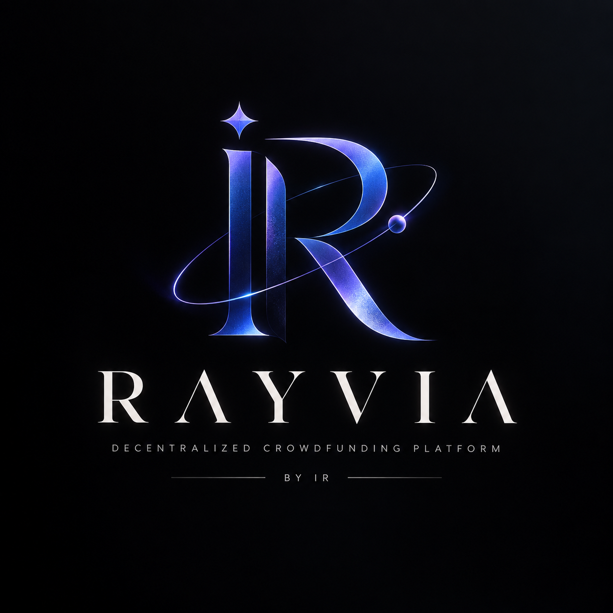

<p align="center">
  
</p>

<p align="center">
  
</p>

<p align="center">
  
</p>

<h2 align="center">🚀 A production-grade Web3 crowdfunding platform built with Solidity, Ethers.js, and React.</h2>

<p align="center">
  
  
  
  
  
</p>

---
> *"A decentralized home for ideas worth building."*  
> **RAYVIA** is an institutional-grade Web3 crowdfunding protocol built on Ethereum smart contracts.  
> Designed with **Solidity 0.8.28**, **Ethers.js v5**, **React 18**, **GSAP**, and **Tailwind CSS v4** for mathematical transparency, zero middleman cuts, and automated refund protections.

---

# ✨ Features

- 🔐 **Zero-Trust Smart Contracts** — Direct non-custodial payouts via immutable Solidity logic.
- 🎯 **Milestone & Refund Protections** — Automatic contributor refunds if funding target is missed by deadline.
- ⚡ **GSAP & Lenis Motion** — Silky smooth momentum scrolling, dynamic hero showcase, and floating tilted cards.
- 🔎 **Real-Time Search & Category Filters** — Search campaigns by name, filter by status (Live/Funded/Ending Soon) and category.
- 💰 **Web3 Wallet Integration** — Connect MetaMask with real-time balance tracking, account switching, and network listeners.
- 📊 **Telemetry & Progress Bar** — Mathematical progress percentage, funded ratios, backer counts, and days remaining calculations.
- 🌙 **Dual Theme (Light & Dark)** — High-contrast slate light mode & midnight dark mode powered by custom CSS variable engine.
- 🛡️ **20 Unit & Integration Tests** — Security audited contract logic preventing double claims, unauthorized withdrawals, and zero-value transfers.

---

# 💡 Why This Project?

This platform demonstrates:

- **EVM Smart Contract Engineering**: Reentrancy protection, state-machine campaign lifecycle, event logging.
- **Modern Web3 UX**: Seamless MetaMask integration with fallback read-only RPC provider.
- **High Visual Standards**: Custom typography, bento grid layout, dynamic progress meters, and confeti celebrations.
- **Automated Protections**: Contributor safety mechanisms enforced entirely on-chain without admin intervention.

---

# 🧩 Tech Stack

| Layer | Technology |
|-------|-----------|
| Smart Contract | Solidity `^0.8.0`, Hardhat, Chai / Mocha |
| Client | React 18, Vite 6, Tailwind CSS 4, Ethers.js 5.7.2 |
| Animation | GSAP 3.12, Lenis 1.3, Canvas Confetti 1.9 |
| Icons & UI | Lucide React 1.44, Custom Theme Context |
| Network | Ethereum Localhost (Hardhat CJS/EVM) / Sepolia Testnet |

---

# 📂 Project Structure

```plaintext
Crowdfunding DApp/
├── contract/
│   └── crowdfunding.sol        # Core Solidity Smart Contract
├── scripts/
│   └── deploy.js               # Contract deployment script
├── test/
│   └── crowdfunding.test.js    # Hardhat Security & Unit Test Suite (20 Passing)
├── client/
│   ├── public/
│   │   └── RAYVIA_LOGO.png     # Official RAYVIA Brand Asset
│   ├── src/
│   │   ├── components/         # Navbar, Footer, ProjectCard, Loading, ThemeToggle, etc.
│   │   ├── context/            # Web3Context, ThemeContext, ToastContext
│   │   ├── pages/              # Home, Discover, CreateProject, ProjectDetail, Profile
│   │   ├── config/             # Contract ABI and deployed address bindings
│   │   ├── index.css           # Tailwind 4 & Dual-Theme CSS variables engine
│   │   └── App.jsx             # Router & layout provider
│   ├── index.html
│   └── package.json
├── hardhat.config.js
└── package.json
```

---

# ⚙️ Installation & Run Locally

### Prerequisites
- Node.js 18+
- MetaMask extension installed in browser

### 1. Smart Contract Test & Node Setup

```bash
# Clone repository
git clone https://github.com/Cipher-Shadow-IR/RAYVIA-Web3-Crowdfunding.git
cd "Crowdfunding DApp"

# Install dependencies & run tests
npm install
npx hardhat test
```

### 2. Start Local Hardhat Blockchain & Deploy

```bash
# Terminal 1: Spin up local Ethereum node
npx hardhat node

# Terminal 2: Deploy smart contract to local node
npx hardhat run scripts/deploy.js --network localhost
```

### 3. Run Client Application

```bash
cd client
npm install
npm run dev
```

Open [http://localhost:5173](http://localhost:5173).

---

# 📬 Smart Contract API Reference

### Contract Methods

| Function | Access | Parameters | Description |
|----------|--------|------------|-------------|
| `createProject` | External | `string _name, string _desc, string _cid, uint256 _goal, uint256 _durationDays, bool _isRefundable` | Deploys a new campaign |
| `contribute` | Payable | `uint256 _id` | Sends ETH directly to campaign escrow |
| `claimFunds` | Creator | `uint256 _id` | Withdraws raised ETH if goal is met after deadline |
| `claimRefund` | Backer | `uint256 _id` | Reclaims ETH if campaign fails goal after deadline |
| `getProjects` | View | — | Returns all deployed projects |

---

# 💬 Author

<p align="center">
  <b>Designed & Developed by Ishaan Ray (Cipher Shadow)</b><br>
  <i>"A decentralized home for ideas worth building."</i><br><br>
  <a href="https://github.com/Cipher-Shadow-IR" target="_blank">
    
  </a>
  <a href="https://linkedin.com/in/ishaan-ray-cs" target="_blank">
    
  </a>
  <a href="https://galaxir.vercel.app/" target="_blank">
    
  </a>
</p>

---

# 📜 License

MIT License © Ishaan Ray
